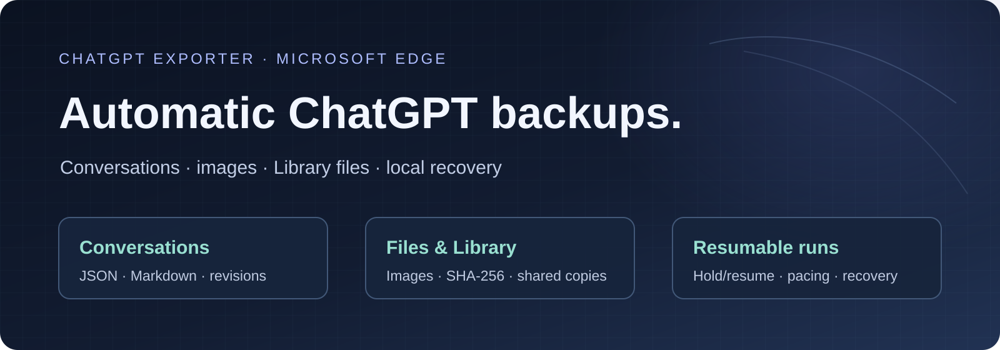
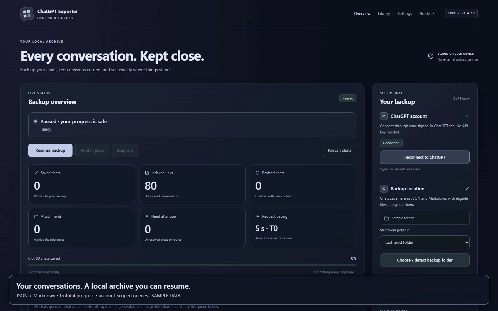
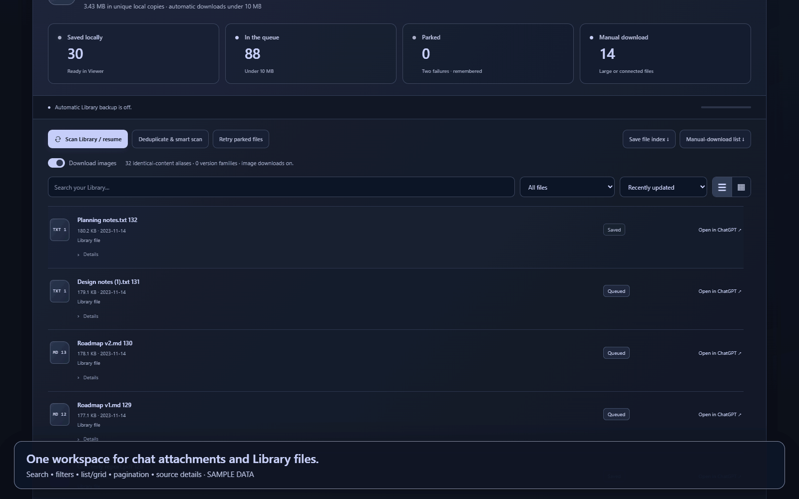
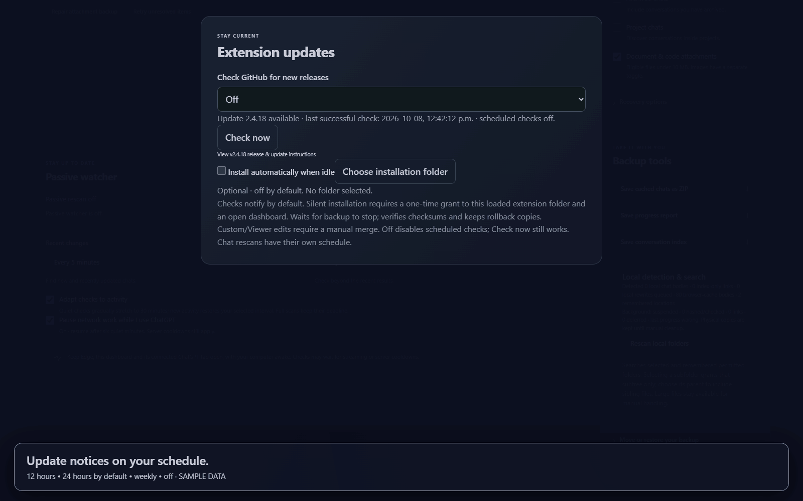
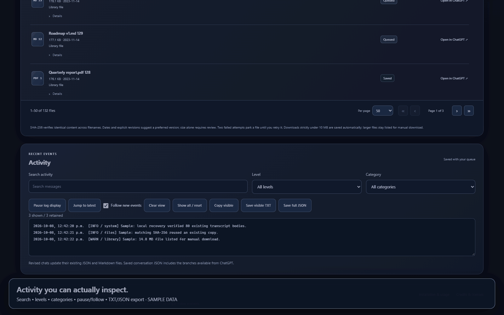

# ChatGPT Exporter
### Automatic ChatGPT backups for Microsoft Edge

**[Download Edge ZIP](https://github.com/kitomisaitichi-design/chatgpt-exporter/releases/latest) · [Install](#install-in-edge) · [Feature catalog](#feature-catalog) · [Demo gallery](#see-it-in-use) · [Release notes](release-notes)**

Automatically export available ChatGPT conversations as **native JSON and readable Markdown**. Back up eligible uploads, generated images and Library files; reuse verified local content; and keep backup queues, revisions and file references together in a folder you choose.

**Latest release — v2.4.20:** Corrects stale Library file-size metadata using verified transferred bytes, reuses SHA-256-identical files across Chat and Library, and recovers file records blocked by the old false-size error. The v2.4.19 update also stopped unnecessary unchanged-chat rewrites and reorganized the dashboard layout. **[Read the v2.4.20 changes](release-notes/v2.4.20.md).**

## Dashboard preview

*Actual extension interface with fictional data and edited playback. [Full-resolution dashboard](docs/media/dashboard.png) · [Demo recording details](docs/DEMO.md).*

## Install in Edge

1. [Download the latest release](https://github.com/kitomisaitichi-design/chatgpt-exporter/releases/latest). Choose the named extension ZIP; its adjacent SHA-256 asset verifies the download.
2. Extract into a permanent folder. Locate **ChatGPT-Exporter-English-Edge**, containing manifest.json.
3. Open **edge://extensions**, enable **Developer mode**, select **Load unpacked**, then select that folder.
4. Open the exporter, connect to your signed-in ChatGPT account/workspace, and choose a backup folder.
5. Choose enabled sources, download/images preferences and export mode, then **Start / resume**. Leave Passive watcher on for continued checks.

No build tools are required. The GitHub source archives also work by selecting their extension subfolder.

**Updating manually:** stop backup, keep a copy of the existing extension folder, replace runtime files in the same location, Reload its existing Edge extension card and refresh the dashboard. Reconnect and resume the same backup. Preserve optional Viewer/custom patches separately. Do not clear browser data or replace the extension identity.

**Automatic installation:** enable the optional idle switch and choose the actual installed extension folder. It verifies release assets and original runtime files before writing, keeps .exporter-rollback snapshots, and reloads after success. Unsupported customizations defer to manual installation. [Full behavior and rollback](docs/FEATURES.md#release-checks-and-optional-silent-installation).

## Feature catalog

| Feature | What you get |
| --- | --- |
| **Chats and revisions** | Active, archived and project discovery; manual links/IDs; native JSON with available branches; selected-branch Markdown; content fingerprints and revision metadata. |
| **Resume and recovery** | Durable queues, local cache, portable checkpoints, nested-folder detection and reconciliation of actual saved files. |
| **Passive watching** | Observed replies/body changes, bounded recent checks and scheduled full scans while Edge, dashboard and connected ChatGPT tab remain open. |
| **One file workspace** | Uploaded/generated chat attachments and owned Library files share identity, content and failure memory while retaining independent sources. |
| **Small automatic downloads** | New transfers strictly below **10,000,000 bytes**; larger, connected-provider and unavailable items stay visible in manual-download catalogs. |
| **Images on or off** | Persistent image preference across chats and Library; existing saved images remain available. |
| **Verified reuse** | Native IDs and SHA-256 lookup; renamed identical bytes share a saved copy. Filename and size alone never prove equality. |
| **Safe deduplication** | Incremental background linking; manual removal of freshly verified exact duplicates with reference updates and recovery journal. |
| **Version evidence** | Numbered-copy families, source dates/revisions and preferred/review labels; distinct content and source history remain. |
| **Adaptive work** | Bounded turns for discovery, chats, files and validation; early Library downloads; visible wait reasons, Hold/Resume and six-minute activity yielding. |
| **Remembered failures** | Two shared remote failures park a file until explicit retry. Local permission/quota faults pause separately. |
| **Fast local indexing** | One shared build, incremental records, resumable candidate cursors, batch checkpoints and bounded background hashing. |
| **Files you can browse** | Search, filters, sorting, list/grid, pagination, source details and offline HTML catalogs. |
| **Viewer handoff** | Relative-path conversation/Library catalogs, shared files, retained sources and distinct versions for Offline Chat Viewer. |
| **Useful activity logs** | Search, severity/category filters, pause/follow, reset, filtered copy/TXT and retained-history JSON export. |
| **Update controls** | 12h / **24h default** / weekly / off checks; manual Check now; optional idle installation with verified assets and rollback. |

[Read every feature, control, limit and recovery rule →](docs/FEATURES.md)

## See it in use

### Browse files, find versions, choose images

### Choose how updates happen

Checks notify in the dashboard by default. **Install automatically when idle** is off until enabled and requires a one-time grant to the loaded extension folder. Keep the dashboard open; backup must be stopped. Every replacement keeps a rollback copy. Local runtime edits, including Viewer adapters, produce a manual-update notice so they can be preserved.

### Find the event you need

## Bring your existing archive

Select an existing backup or its enclosing parent. Under **Reuse files you already have**, grant folders containing older exports or originals. Detection searches supported nested folders, prior indexes, IDs and verified hashes. Use **Rescan chats** for a chat discovery pass; local folder rescans are separate from extension release checks.

A saved-chat count is based on real validated transcript files, not the number of discovered links. The extension cannot access unselected Documents, Downloads or Desktop folders. A server file that is gone needs a verified local original or another accessible source route.

## Open it in Offline Chat Viewer

[Get the latest Viewer](https://github.com/kitomisaitichi-design/chatgpt-viewer/releases/latest), select the **complete backup root**, and open Files & Library. Keep JSON, Markdown, conversation index and attachments together. Exported catalog schemas remain compatible; source references and distinct versions are retained.

Historical full integration fixtures used Viewer 1.1.6. A fresh end-to-end import into the latest Viewer was not run for this patch. Optional local Viewer bridge patches must be preserved during a manual upgrade; silent installation defers when it finds modified runtime files.

## What is saved

| Output | Purpose |
| --- | --- |
| json/ and markdown/ | Retrieved conversations and readable selected branches |
| attachments/content/ | Hash-addressed saved binaries; original names remain in catalogs |
| conversation-index.json | Identity, revisions, source metadata and attachment references |
| attachments/library-index.json | Library inventory, paths, hashes, sources and status |
| attachments/library-catalog.html | Offline file browsing |
| attachments/manual-downloads.html / .json | Large, unavailable and unfinished files |
| export-report.json and portable-state.json | Progress, errors and portable queue/schedule |
| viewer-handoff.json | Viewer metadata and linked paths |

The cached-chat ZIP contains transcripts and queue/index metadata. Compress the **whole backup folder** to include file binaries and Library catalogs.

## Privacy, limits and verification

No analytics or chat-upload backend. Authentication stays in your signed-in ChatGPT page. Release checks contact GitHub for public metadata; optional installation downloads release assets. Private ChatGPT endpoints can change, and discovery only covers what enabled accessible routes expose.

[Validation and honest test boundaries](docs/VALIDATION.md) · [Complete version history](docs/HISTORY.md) · [Feature guide](docs/FEATURES.md) · [Third-party notices](ChatGPT-Exporter-English-Edge/THIRD-PARTY-NOTICES.md)

MIT-licensed repository code; bundled components keep their own licenses.
